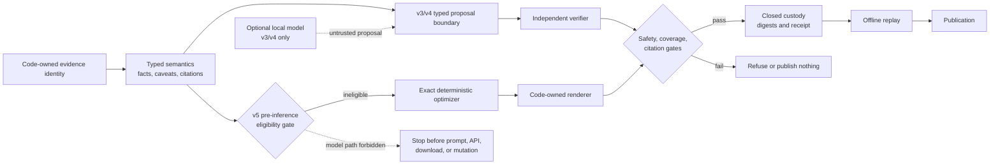
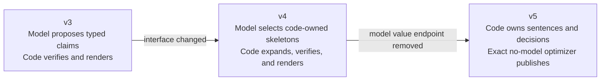
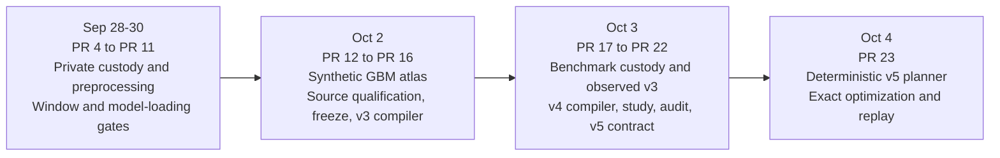

# VoxelScope

> **Models may propose. Deterministic systems decide what can be trusted and published.**

VoxelScope is offline-first research infrastructure for hash-bound evidence, fail-closed
local AI, and replayable 3D MRI segmentation experiments.

| Runtime | Operating mode | Status | License |
|---|---|---|---|
| Python 3.12+ | Offline after dependency sync | Research-only alpha | Apache-2.0 |

> [!CAUTION]
> **NO-GO boundary:** no clinical use, diagnosis, prognosis, treatment, patient-specific
> claim, biological-causality claim, protein ranking, therapeutic-target designation,
> druggability claim, or production-readiness claim. No new real biomedical-data
> acquisition, access, processing, model loading, or inference is authorized by this
> README or the current communication milestone. Future private steps require a
> separately approved, hash-bound protocol.

## System at a glance



| Boundary | Trusted owner | Rule |
|---|---|---|
| Evidence values, identities, citations, caveats, final sentences | Code | Canonical, typed, digest-bound |
| v3/v4 proposal | Optional local model or recorded fixture | Untrusted until independently verified |
| v5 planning | Exact deterministic optimizer | Local model is ineligible and forbidden |
| Terminal state and publication | Code | Gates pass, or the system refuses |
| Custody and replay | Code | Closed file set, immutable receipt, exact offline reconstruction |

## Current status

| Surface | Evidence-backed state | Boundary |
|---|---|---|
| v5 baseline | Merge `bb9b7b7` from [PR #23](https://github.com/Siddhant-K-code/VoxelScope/pull/23); [post-merge CI](https://github.com/Siddhant-K-code/VoxelScope/actions/runs/37179720138) passed all five jobs | Verified 2026-10-04 |
| v5 communication | Exact finite optimization, code-owned prose, optimality certificate, atomic publication, offline replay | Control case only; `model_actions=0`, `network_actions=0` |
| v3/v4 communication | Two immutable, synthetic, non-clinical local-model studies with complete custody trees | Descriptive compiler evidence, not model-quality or safety evidence |
| GBM evidence atlas | Executable synthetic atlas plus open-source qualification and source freeze | No production ingestion, patient records, protein ranking, or actionability |
| MRI path | Closed evidence for private custody, preprocessing, and window qualification; public synthetic verification for positional and model-loading gates | Private model qualification, any forward pass, and all inference remain **NO-GO** |

Model-training overlap and source-label versus model-output semantics remain unresolved.
No diagnostic-accuracy or real-segmentation-preservation claim is allowed.

## Evidence communication evolution

Arrows show contract evolution, not model-performance ordering.



| Generation | Model role | Recorded evidence | Correct reading |
|---|---|---|---|
| v3 observed study | Typed claims plus untrusted draft text | `0 / 18` accepted; `18 / 18` refused; `4 / 18` invalid outer outputs | Closed historical result; refusal is not a hallucination count |
| v4 observed study | Select 15 code-owned skeletons plus untrusted text | **Perfect task protocol:** `270 / 270` selected, zero unknown, duplicate, or omitted tasks, `0 / 18` invalid outputs; `6 / 18` accepted, `12 / 18` refused; semantic variance `3 / 9` | Changed interface and semantic projection; no improvement, quality, or superiority claim |
| v5 deterministic control | None | Complete feasible-set enumeration, exact lexicographic optimum, `0` model actions, `0` network actions | Contract and test evidence only; no observed v5 model evidence |

Only these emitted-coverage endpoints retain matching v3/v4 definitions and
denominators:

| Declared comparable endpoint | v3 observed | v4 observed |
|---|---:|---:|
| Emitted fact coverage | `0 / 158` | `42 / 158` |
| Emitted caveat coverage | `0 / 148` | `60 / 148` |

Final states, invalid-output rate, semantic variance, verified-draft coverage,
latency, tokens, task metrics, and all v5 control evidence are not directly
comparable across generations. The table does not establish model quality,
causality, safety, generalization, significance, or superiority.

## Seven-day evolution

The trailing calendar window is 2026-09-28 through 2026-10-04, inclusive.



The progression is custody-first: acquire or propose only inside a declared
boundary, preserve the evidence, verify independently, replay offline, then decide
whether publication is permitted.

## Deterministic publication and custody

```mermaid
flowchart LR
    A["Clean commit and root tree"] --> B["Canonical request and sentence catalog"]
    B --> C["Eligibility record<br/>model inference forbidden"]
    C --> D["Enumerate complete feasible set"]
    D --> E["Lexicographic optimum<br/>plus certificate"]
    E --> F["Render and verify every gate"]
    F --> G["Stage files and fsync"]
    G --> H["Atomic no-replace rename"]
    H --> I["Write immutable receipt last"]
    I --> J["Replay offline at exact revision"]
```



Schema, identity, citation, coverage, safety, budget, optimality, custody, or replay
failure stops publication. A crash before the terminal receipt leaves an unclosed
bundle that replay refuses.

## Quickstart

Prerequisites: Python 3.12+ and [uv](https://docs.astral.sh/uv/). Dependency
installation may use the configured package index. VoxelScope commands are offline
after dependencies are present.

```bash
uv sync --frozen
make demo
make custody-validate
```

Build the synthetic GBM evidence atlas:

```bash
uv run python -m voxelscope.gbm_atlas_cli build \
  --manifest research/gbm-evidence-atlas-v1/source-manifest.json \
  --output build/gbm-atlas
```

Verify and exercise the deterministic v5 control from a clean Git checkout:

```bash
uv run python -m voxelscope.evidence_communication_v5_cli contract-verify \
  --repository-root .
uv run python -m voxelscope.evidence_communication_v5_cli fixture-compile \
  --repository-root . \
  --run-id deterministic-control-v1 \
  --output build/evidence-communication-v5-control
uv run python -m voxelscope.evidence_communication_v5_cli replay \
  --repository-root . \
  --bundle build/evidence-communication-v5-control
```

Publication commands refuse occupied destinations. The v5 compiler also refuses a
dirty index or worktree because source custody is part of the evidence identity.

Run the full repository validation:

```bash
make validate
```

## Protocol map

| Area | Detailed record |
|---|---|
| Communication compiler | [v3 trust boundary and metrics](docs/evidence-communication-compiler-v3.md), [v4 bounded skeleton contract](docs/evidence-communication-compiler-v4.md), [v4 study protocol](docs/evidence-communication-v4-study.md) |
| Deterministic communication | [prospective v5 contract](docs/evidence-communication-v5-discourse-planner-contract.md), [v5 implementation and replay](docs/evidence-communication-v5-discourse-planner.md) |
| Immutable observed evidence | [v3 local-model study](research/gbm-evidence-communication-qwen3-8b-q8-study-v1/README.md), [v4 local-model study](research/gbm-evidence-communication-qwen3-8b-q8-study-v4/README.md), [v4 lexical audit](research/evidence-communication-v4-lexical-audit-v1/README.md) |
| Evidence atlas | [product contract](docs/glioblastoma-evidence-atlas-v0.md), [source qualification](docs/research/glioblastoma-evidence-atlas-source-qualification-v1.md), [source freeze](docs/research/glioblastoma-evidence-atlas-source-freeze-v1.md) |
| MRI custody | [real-data readiness](docs/real-data-readiness-v1.md), [active one-volume feasibility protocol](docs/one-volume-feasibility-protocol-v2.md), [private custody workflow](docs/private-custody-workflow-v1.md) |
| MRI execution gates | [preprocessing](docs/preprocessing-adapter-v1.md), [positional window bridge](docs/milestone-6-window-bridge-readiness-v1.md), [private window qualification](docs/milestone-7-window-execution-readiness-v1.md), [corrected model-loading gate](docs/milestone-8-model-loading-readiness-v2.md) |
| Future owner actions | [execution runbook](docs/future-execution-runbook.md) |

Historical synthetic arrays use `(C, Z, Y, X)` coordinate names, not anatomical
directions. The positional bridge binds preprocessing `(I, J, K)` to model
`(D, H, W)` without reorientation or an anatomical-direction claim. The historical
engine's high-side padding and MONAI 1.4.0 symmetric padding are distinct policies.

## License

VoxelScope is licensed under Apache-2.0. Model and dataset artifacts retain their
own licenses and are not distributed by this repository.
