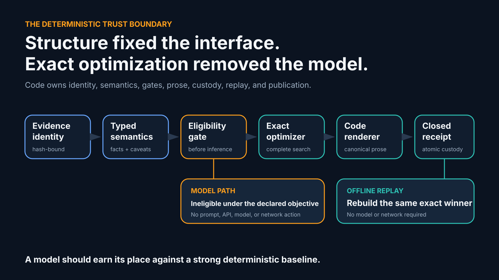
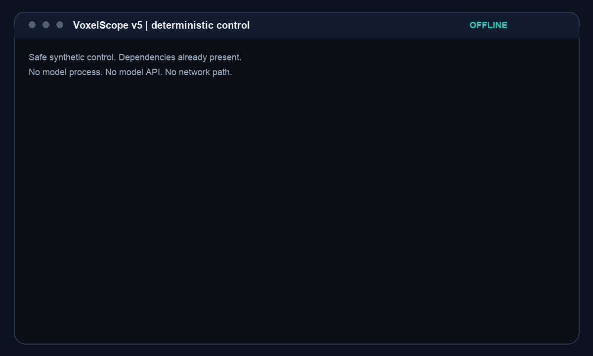

# Structure fixed the interface. Exact optimization removed the model.



> [!NOTE]
> This is a software design story built from synthetic, non-clinical evidence. It
> separates observed model studies from fixture, audit, contract, and deterministic
> control evidence. It makes no clinical, biomedical, causal, model-quality, safety,
> generalization, significance, or superiority claim.

VoxelScope started with a narrow question: can a local model propose an explanation
while deterministic code decides what can be trusted and published?

The answer changed the system three times.

- **v3** exposed a repeatable construction-verifier mismatch. The failure was not a
  useful count of hallucinations.
- **v4** moved claim structure into code. The bounded interface eliminated protocol
  and task-set failures in the observed study, but semantic variance and lexical
  exclusions remained.
- **v5** asked a harder question before inference: does the model have any declared
  value left to add? For the frozen publication objective, exact deterministic
  optimization settled every valued decision. The model became ineligible.

The result is a decision rule, not an anti-model slogan:

> **A model should earn its place against a strong deterministic baseline.**

## The evidence ledger

The generations do not all produce the same kind of evidence.

| Record | Evidence type | What it can establish | What it cannot establish |
|---|---|---|---|
| v3 local-Qwen3 study | Observed model evidence from one frozen synthetic study | The exact 18-run terminal, coverage, custody, and repeatability observations under the v3 contract | General model quality, safety, biomedical validity, or a hallucination rate |
| v4 local-Qwen3 study | Observed model evidence from one prospectively frozen synthetic study | The exact bounded task, terminal, coverage, variance, token, latency, and custody observations under the v4 contract | Direct improvement for transformed endpoints, generalization, significance, or superiority |
| v4 lexical audit | Post-hoc deterministic mechanical audit | Why 108 frozen verifier exclusions received their original lexical labels and how three mechanical context categories distribute | Substantive unsafe-text truth or a changed study result |
| v5 contract and implementation | Prospective contract plus code and test evidence | The objective is a complete finite optimization problem and the implementation returns an exact winner or fails closed | Observed v5 model behavior or subjective communication quality |
| v5 bundled control | Deterministic contract-test evidence | Publication and replay use zero model and network actions | A model comparison or biomedical result |

Immutable records:

- v3: [observed result](https://github.com/Siddhant-K-code/VoxelScope/blob/936549dcbf8c563cdef896bdb442a7629dcd260d/research/gbm-evidence-communication-qwen3-8b-q8-study-v1/result-summary.json),
  [failure analysis](https://github.com/Siddhant-K-code/VoxelScope/blob/936549dcbf8c563cdef896bdb442a7629dcd260d/research/gbm-evidence-communication-qwen3-8b-q8-study-v1/failure-analysis.md),
  and [PR #18](https://github.com/Siddhant-K-code/VoxelScope/pull/18).
- v4: [prospective declaration and comparator policy](https://github.com/Siddhant-K-code/VoxelScope/blob/5730052de74cc943955efe5b148fd4c7b34bc987/docs/evidence-communication-v4-study.md),
  [observed result](https://github.com/Siddhant-K-code/VoxelScope/blob/5730052de74cc943955efe5b148fd4c7b34bc987/research/gbm-evidence-communication-qwen3-8b-q8-study-v4/result-summary.json),
  and [PR #21](https://github.com/Siddhant-K-code/VoxelScope/pull/21).
- v4 audit and v5 contract: [lexical audit](https://github.com/Siddhant-K-code/VoxelScope/blob/df71bc4c6c68937d3b4e22229e23f2cde315f9c6/research/evidence-communication-v4-lexical-audit-v1/audit.json),
  [design contract](https://github.com/Siddhant-K-code/VoxelScope/blob/df71bc4c6c68937d3b4e22229e23f2cde315f9c6/research/evidence-communication-v5-discourse-planner-contract-v1/design-contract.json),
  and [PR #22](https://github.com/Siddhant-K-code/VoxelScope/pull/22).
- v5: [implementation and replay record](https://github.com/Siddhant-K-code/VoxelScope/blob/bb9b7b798d413da49cfefa9ebaae3fc2a00da59b/docs/evidence-communication-v5-discourse-planner.md)
  and [PR #23](https://github.com/Siddhant-K-code/VoxelScope/pull/23).

## v3: the boundary failed in a repeatable way

The v3 design gave a local model a strict typed envelope. The model proposed claims,
requirement bindings, source identifiers, and draft text. Deterministic code parsed,
verified, rebuilt accepted claims from checked fields, rendered canonical prose, and
closed the receipt.

The observed study completed exactly 18 requests over nine synthetic cases with two
repeats each:

| v3 observation | Frozen result |
|---|---:|
| Accepted or partially excluded | `0 / 18` |
| Refused | `18 / 18` |
| Invalid outer outputs | `4 / 18` |
| Evidence-citation validity | `342 / 342` |
| Compiler-defined semantic variance | `0 / 9` |
| Emitted fact coverage | `0 / 158` |
| Emitted caveat coverage | `0 / 148` |

All nine repeat pairs were byte-identical at the model-outcome level. In each of the
14 parsed envelopes, 13 of 17 claims verified and four were excluded. Across those
runs, the exclusions were:

- 28 requirement-binding mismatches caused by separate plan entries colliding with
  combined verifier units;
- 14 safe causal-negation strings rejected by substring matching; and
- 14 safe target or druggability negations rejected by substring matching.

Four other runs preserved only `invalid_json_type`, output digest, and byte length,
as the frozen custody design required. Their raw text was not retained and cannot be
interpreted further.

The important result was architectural. The model followed the exposed construction
more literally than the verifier contract allowed, while the lexical gate rejected
requested negations. The system correctly failed closed, but the interface had made
valid construction unnecessarily difficult.

**Refusal was the terminal state. It was not a generic hallucination count.**

## v4: put structure in code

v4 changed the model's job. Deterministic code derived 15 complete typed claim
skeletons per request. Each skeleton bound the exact claim type, evidence fields,
requirements, citations, and identity. The model returned only:

```json
{
  "entries": [
    {
      "draft_text": "untrusted text",
      "skeleton_id": "skeleton:<sha256>"
    }
  ]
}
```

Trusted code expanded the selected identifiers, verified the result, and rendered
canonical prose. The model no longer constructed evidence identities or typed
semantics.

The observed v4 study made 18 generation requests with no warmup, retry, selective
rerun, or manual repair:

| v4 observation | Frozen result |
|---|---:|
| Returned and matched skeleton tasks | `270 / 270` |
| Unknown / duplicate / omitted tasks | `0 / 0 / 0` |
| Invalid model outputs | `0 / 18` |
| Accepted / partially excluded / refused | `6 / 0 / 12` |
| Lexical exclusions | `108 / 270` across 12 runs |
| Compiler-defined semantic variance | `3 / 9` repeat pairs |

Structure removed the v3 protocol mismatch from the model interface. It did not make
the remaining semantic problem disappear.

The 108 exclusions removed required bindings from all 12 refused runs. A separate
post-hoc mechanical audit classified them as:

| Mechanical category | Count |
|---|---:|
| Explicit negation or boundary disclaimer | `12` |
| Affirmative clinical-process statement | `4` |
| Ambiguous or context-dependent | `92` |

These labels explain gate behavior. They are not a substantive safety judgment about
the untrusted text. Three repeat pairs also produced different verified semantic
projections. Under v4, free-form wording still had authority to determine whether a
code-owned skeleton survived the lexical gate.

## The only declared v3/v4 comparison

Only final emitted fact and caveat coverage kept the same definitions and
denominators:

| Matching endpoint, descriptive only | v3 observed | v4 observed |
|---|---:|---:|
| Emitted fact coverage | `0 / 158` | `42 / 158` |
| Emitted caveat coverage | `0 / 148` | `60 / 148` |

Terminal states, invalid-output rate, semantic variance, verified-draft coverage,
latency, tokens, task metrics, lexical categories, and v5 control evidence are
generation-specific observations. They are not direct superiority measures.


## v5: ask whether inference is eligible

v5 removed free-form prose from the planning interface. Code owns:

- every final sentence, fact, caveat, citation, source identifier, safety boundary,
  utility value, ordering constraint, anchor, and byte budget;
- one caller-owned audience profile that a planner cannot change; and
- the renderer, verifier, optimizer, publication state machine, custody, and replay.

The remaining plan decisions are finite:

1. order request-owned units within code-owned constraints;
2. include a subset of request-enumerated optional units; and
3. choose request-enumerated caveat anchors and before-or-after placement.

The objective is also exact:

1. require every schema, identity, coverage, citation, protocol, safety, ordering,
   and byte-budget gate;
2. maximize request-pinned integer utility;
3. minimize exact rendered UTF-8 bytes among maximum-utility plans; and
4. minimize canonical decision-key bytes as the final tie-break.

The production optimizer enumerates the complete bounded feasible set. It does not
fall back to a heuristic. The optimality certificate closes the search-space digest,
candidate counts, winner identity, objective values, renderer identity, and optimizer
identity. Offline replay runs the same complete search and requires the same winner
byte for byte.

Once that baseline existed, the pre-inference eligibility test had a concrete
answer:

| Declared value surface | Deterministic status |
|---|---|
| Mandatory facts, caveats, citations, protocol, safety, budget | Hard publication gates |
| Optional-unit utility | Exactly maximized |
| Emitted bytes | Exactly minimized after utility |
| Audience identity | Caller-owned, not a planner decision |
| Ordering or placement preference | No preregistered value endpoint |
| Model latency and tokens | Costs, not value under this contract |

There was no declared value endpoint left for a model to improve. The eligibility
record is written before optimization and records:

```text
gate_result=model_inference_forbidden
model_eligibility_status=ineligible_deterministic_dominance
model_candidate_action_count=0
```

The bundled control has no prompt builder, model runner, endpoint, model artifact
path, or injectable hook. Compile and replay both report `model_actions=0` and
`network_actions=0`.



## What deterministic code should own

The progression produced a sharper trust boundary:

| Surface | Owner | Reason |
|---|---|---|
| Evidence identity and source bindings | Deterministic code | A proposal cannot define the evidence that authorizes itself |
| Typed semantics and required caveats | Deterministic code | Missingness, freshness, joins, and boundaries need explicit states |
| Safety and publication gates | Deterministic code | Failure must refuse or publish nothing |
| Final rendering | Deterministic code | Accepted text must be reconstructed from verified values |
| Custody and receipt closure | Deterministic code | Every published byte needs a closed identity |
| Offline replay | Deterministic code | Trust should survive without the original runtime or model |
| Optional model proposal | Eligible only after a prospective value case | Inference cost alone is not value |

This does not mean models have no place. It means their role should be justified by
an objective the deterministic baseline cannot already settle. A future subjective
communication objective would need a separately reviewed prospective amendment and
a properly blinded human-evaluation protocol before any model run.

## Reproduce the deterministic control

From a clean checkout with dependencies already present:

```bash
uv run python -m voxelscope.evidence_communication_v5_cli contract-verify \
  --repository-root .
uv run python -m voxelscope.evidence_communication_v5_cli fixture-compile \
  --repository-root . \
  --run-id deterministic-control-v1 \
  --output build/evidence-communication-v5-control
uv run python -m voxelscope.evidence_communication_v5_cli replay \
  --repository-root . \
  --bundle build/evidence-communication-v5-control
```

The compiler refuses a dirty Git tree because source custody is part of the evidence
identity. Publication is staged, fsynced, atomically renamed without replacement,
and closed by an immutable receipt written last. Replay rejects missing, extra,
swapped, noncanonical, symlinked, digest-mismatched, nonoptimal, or custody-drifted
content.

## Strict non-claims

This work does not establish clinical utility, diagnosis, prognosis, treatment
quality, patient-specific validity, biological causality, protein ranking, target
designation, druggability, real biomedical-data handling, subjective communication
quality, general model quality, safety, generalization, significance, production
readiness, or superiority.

No clinical use, model loading, inference, real biomedical-data acquisition, access,
or processing is authorized by this article.
