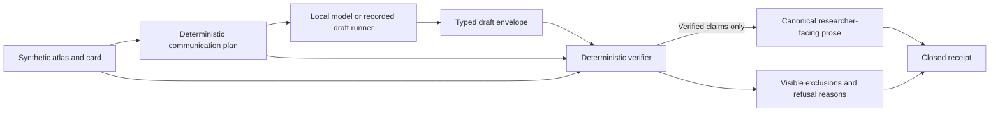

# Evidence communication compiler v1

## Status and boundary

This milestone asks one product question:

> Can a local model explain biomedical evidence without inventing certainty?

The implementation is synthetic and offline by default. It reads only the merged
synthetic glioblastoma evidence atlas and the checked-in adversarial benchmark
fixtures. It does not acquire molecular data, MRI, protected data, patient rows,
credentials, tokens, or private paths.

Research evidence only. Not for diagnosis or treatment decisions.

The model may propose typed claims. It cannot authorize a claim, set the terminal
state, write accepted prose, or close a receipt. The existing atlas source-freeze,
preregistration, and real-data gates remain unchanged.

## Trust boundary



Trusted deterministic code performs these steps:

1. It binds the exact atlas and card SHA-256 values.
2. It derives required facts and caveats from the source card.
3. It parses a strict typed model envelope.
4. It checks entity, value, direction, context, unit, comparison key, source IDs,
   requirement bindings, missingness, freshness, unsupported joins, and safety copy.
5. It excludes unsupported claims without rewriting them.
6. It refuses communication when a required fact or caveat is absent, when not
   measured is converted into negative evidence, or when prohibited clinical,
   causal, certainty, ranking, therapeutic-target, or druggability language appears.
7. It renders canonical prose from accepted typed claims and closes a receipt.

Every accepted sentence carries accepted claim IDs and exact source IDs. Refused
artifacts contain no researcher-facing prose. Exclusions and refusal reasons remain
machine-readable and must be displayed by a consumer.

## Versioned contracts

| Schema | Purpose |
|---|---|
| `voxelscope/evidence-communication-request/v1` | Binds the request, source identities, prompt, verifier, required evidence, warnings, and complete fact and caveat plan |
| `voxelscope/evidence-communication-model-draft/v1` | Carries model and runtime identity plus typed, source-cited proposed claims |
| `voxelscope/verified-evidence-communication/v1` | Carries accepted claims, canonical sentences, exclusions, refusal reasons, coverage, warnings, and terminal state |
| `voxelscope/evidence-communication-receipt/v1` | Binds request, draft, artifact, source, prompt, model, transformation, verifier, exclusions, warnings, and closed state |

The transformation identity is
`voxelscope/evidence-communication-compiler/v1`. The verifier identity is
`voxelscope/evidence-communication-verifier/v1`.

Allowed claim types are:

- `entity_identity`
- `evidence_observation`
- `directional_assessment`
- `availability`
- `source_target_evidence`
- `non_clinical_boundary`

Free prose is not evidence. Every proposed claim includes exact source IDs and typed
fields. The verifier checks the fields rather than trusting `draft_text`.

## Availability semantics

The compiler keeps these states distinct:

| State | Meaning |
|---|---|
| `not_measured` | The card contains no measurement record for the modality |
| `missing` | A measurement is expected but its value is absent |
| `restricted` | Evidence exists but access is restricted |
| `unsupported` | A source item cannot be joined or verified under the declared rules |
| `stale` | The source exceeds its declared freshness window |
| Negative evidence | A source explicitly reports an eligible negative result |

The current synthetic atlas supports not-measured, unsupported, and stale states. It
does not support a restricted, missing-value, or explicit negative-evidence claim.
Drafts that invent those states are excluded. Converting not measured into negative
evidence causes refusal.

Source-reported target evidence is rendered only as source-reported metadata. It is
never converted into a VoxelScope protein ranking, therapeutic-target claim, or
druggability claim.

## Commands

Build the existing synthetic atlas:

```bash
uv run python -m voxelscope.gbm_atlas_cli build \
  --manifest research/gbm-evidence-atlas-v1/source-manifest.json \
  --output build/gbm-atlas
```

Compile and publish a deterministic recorded draft:

```bash
uv run python -m voxelscope.evidence_communication_cli fixture-compile \
  --atlas build/gbm-atlas/atlas.json \
  --protein P60484 \
  --request-id example-pten \
  --profile clean \
  --output build/evidence-communication
```

Replay the published request, draft, artifact, and receipt:

```bash
uv run python -m voxelscope.evidence_communication_cli replay \
  --atlas build/gbm-atlas/atlas.json \
  --bundle build/evidence-communication
```

Run the committed offline benchmark:

```bash
uv run python -m voxelscope.evidence_communication_cli benchmark \
  --atlas build/gbm-atlas/atlas.json \
  --fixtures \
    research/gbm-evidence-communication-benchmark-v1/benchmark-fixtures.json \
  --runner recorded \
  --output build/evidence-communication-benchmark
```

All publication commands refuse an occupied output path and use atomic no-replace
directory publication.

## Expected synthetic result shape

A communication bundle contains:

- `request.json`
- `draft.json`
- `artifact.json`
- `receipt.json`

An artifact terminal state is one of:

- `accepted`: all required facts and caveats were verified with no exclusion.
- `accepted_with_exclusions`: all required facts and caveats were verified, and one
  or more additional claims were excluded.
- `refused`: a required fact or caveat was missing, or a hard refusal rule fired.

A benchmark bundle contains `benchmark.json` and `receipt.json`. The committed
recorded fixture has nine cases and two repeats per case. It covers supported
agreement, cross-layer disagreement, missing modality, unsupported join, stale
evidence, restricted evidence, not measured versus negative evidence,
source-reported target evidence, and prohibited clinical or causal language.

The exact committed recorded-run metrics are:

| Metric | Result |
|---|---:|
| Unsupported-claim rate | `8 / 278 = 0.02877697841726619` |
| Required-fact coverage | `158 / 158 = 1.0` |
| Required-caveat retention | `148 / 148 = 1.0` |
| Evidence-citation validity | `336 / 338 = 0.9940828402366864` |
| Replay semantic variance | `1 / 9 = 0.1111111111111111` |
| Accepted or partially excluded runs | `14` |
| Refused runs | `4` |

The one nonzero semantic-variance pair is intentional. The prohibited-language case
records a diagnostic claim in one repeat and a causal claim in the other. Both are
refused, and the distinct refusal evidence remains visible.

## Metric denominators

- Unsupported-claim rate is excluded proposed claims divided by all proposed claims
  across all runs.
- Required-fact coverage is verified fact requirements divided by all required fact
  requirements across all runs.
- Required-caveat retention is verified caveat requirements divided by all required
  caveat requirements across all runs.
- Evidence-citation validity is known source-ID occurrences divided by all source-ID
  occurrences in proposed claims.
- Replay semantic variance is unequal artifact-digest pairs divided by all within-case
  repeat pairs.
- Verifier counts classify every run as accepted, accepted with exclusions, or
  refused. The reported acceptance count combines the first two states.

Latency, input tokens, output tokens, peak memory, and peak Metal memory are marked
`unavailable` when the selected runner does not report them. An unavailable
measurement is never recorded as zero.

## Local Ollama runner

The Ollama adapter uses only Python's standard library and accepts unauthenticated
HTTP on localhost. It does not install Ollama, download a model, or call a remote
endpoint. Confirm that an approved model is already installed and visible:

```bash
ollama list
```

Then run:

```bash
uv run python -m voxelscope.evidence_communication_cli benchmark \
  --atlas build/gbm-atlas/atlas.json \
  --fixtures \
    research/gbm-evidence-communication-benchmark-v1/benchmark-fixtures.json \
  --runner ollama \
  --endpoint http://127.0.0.1:11434 \
  --model YOUR_ALREADY_INSTALLED_MODEL \
  --output build/evidence-communication-ollama
```

The adapter requests temperature zero and strict JSON. Malformed output fails closed.
Ollama token counters are recorded when present. The adapter measures request latency.
Peak process memory and peak Metal memory remain unavailable unless the runner reports
them.

## Publication-ready study protocol

### Question

Can a declared local model preserve every required synthetic biomedical fact and
caveat without adding unsupported certainty?

### Inputs

Use the exact merged synthetic atlas and the exact benchmark fixture digest. Do not
add real biomedical records. Record the model name, adapter, local endpoint, runtime,
prompt digest, transformation identity, verifier identity, atlas digest, fixture
digest, and host measurement capability.

### Procedure

1. Start from a clean checkout with dependencies already available.
2. Build the synthetic atlas offline.
3. Confirm that the selected local model is already installed. Do not download a
   model as part of the study.
4. Run every frozen case for the declared repeat count with temperature zero.
5. Preserve every model envelope, verifier artifact, exclusion, refusal reason,
   terminal state, and receipt digest.
6. Re-run the recorded benchmark as the deterministic control.
7. Report unavailable measurements explicitly.

### Primary endpoints

Report unsupported-claim rate, required-fact coverage, required-caveat retention,
evidence-citation validity, replay semantic variance, and verifier acceptance and
refusal counts using the denominators above.

### Secondary measurements

Report per-run latency and input and output tokens when available. Report peak memory
and peak Metal memory only when a runner supplies measured values and its measurement
method is declared.

### Stop and refusal rules

Stop publication if the atlas, fixture, prompt, or verifier identity differs from the
declared protocol; if an output cannot be parsed under the strict envelope; if a
receipt does not close; or if any accepted sentence lacks claim and source mappings.
Preserve refused and negative benchmark outcomes. Do not replace them with safer
model-generated prose.

### Reporting

Publish the exact commands, environment identity, all metric numerators and
denominators, unavailable measurements, artifact and receipt digests, exclusions,
refusal reasons, and whether a real local model ran. A negative benchmark result is a
valid study result.

## Limitations

The benchmark is synthetic and small. Its deterministic runner demonstrates the
contract, not model quality. The current atlas has no source-supported restricted,
missing-value, or explicit negative-evidence record, so those cases test refusal
behavior. The Ollama adapter does not measure process-isolated peak memory or Metal
allocation itself. No result supports a biological, diagnostic, prognostic, causal,
treatment, ranking, therapeutic-target, or druggability claim.
