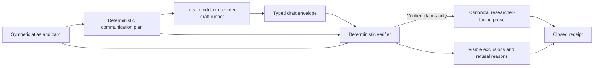

# Evidence communication compiler v3

## Status and boundary

This milestone asks one product question:

> Can a local model explain biomedical evidence without inventing certainty?

The implementation is synthetic and offline by default. It reads only the merged
synthetic glioblastoma evidence atlas and the checked-in adversarial benchmark
fixtures. It does not acquire molecular data, MRI, protected data, patient rows,
credentials, tokens, or private paths.

Research evidence only. Not for diagnosis or treatment decisions.

The model may propose typed claims. It cannot authorize a claim, set the terminal
state, write accepted prose, or close a receipt. The existing atlas source-freeze,
preregistration, and real-data gates remain unchanged.

## Trust boundary



Trusted deterministic code performs these steps:

1. It binds the exact atlas and card SHA-256 values.
2. It derives required facts and caveats from the source card.
3. It parses a strict typed model envelope.
4. It checks entity, value, direction, context, unit, comparison key, source IDs,
   requirement bindings, missingness, freshness, unsupported joins, and safety copy.
5. It excludes unsupported claims without rewriting them.
6. It refuses communication when a required fact or caveat is absent, when not
   measured is converted into negative evidence, or when prohibited clinical,
   causal, certainty, ranking, therapeutic-target, or druggability language appears.
7. It replaces accepted draft claims with verified claims that contain only checked
   typed fields and deterministic identities. Raw model text and model-local claim
   IDs remain untrusted.
8. It renders canonical prose from verified claims and closes a receipt.

Every accepted sentence carries verified claim IDs and exact source IDs. Refused
artifacts contain no researcher-facing prose. Exclusions and refusal reasons remain
machine-readable and must be displayed by a consumer.

## Versioned contracts

| Schema | Purpose |
|---|---|
| `voxelscope/evidence-communication-request/v3` | Binds the request, source identities, prompt, verifier, required evidence, warnings, and complete fact and caveat plan |
| `voxelscope/evidence-communication-model-draft/v3` | Carries immutable model-manifest and exact runtime identity plus untrusted typed, source-cited proposed claims and draft text |
| `voxelscope/verified-evidence-communication/v3` | Carries verified typed claims without raw model text, canonical sentences, exclusions, refusal reasons, separate draft and emitted coverage, warnings, and terminal state |
| `voxelscope/evidence-communication-receipt/v3` | Binds request, parsed draft or digest-safe invalid-output evidence, artifact, source, prompt, model, transformation, verifier, exclusions, warnings, and closed state |
| `voxelscope/evidence-communication-benchmark-fixture/v3` | Freezes adversarial cases, repeat counts, terminal states, and recorded custody digests |
| `voxelscope/evidence-communication-benchmark/v3` | Carries per-run custody and semantic digests, separate coverage metrics, invalid-output outcomes, measurements, runner configuration, and aggregate metrics |
| `voxelscope/evidence-communication-benchmark-index/v3` | Enumerates every expected run path and every request, draft or invalid-output record, verified artifact, communication receipt, and measurement digest |
| `voxelscope/evidence-communication-runner-measurement/v3` | Records per-run latency, token, memory, and Metal measurements as measured values or explicit unavailable states |
| `voxelscope/evidence-communication-invalid-output/v3` | Preserves only the model-output parse/schema error code, byte count, SHA-256, request identity, and immutable runner identity |
| `voxelscope/evidence-communication-benchmark-receipt/v3` | Closes the aggregate report, canonical index, and every indexed per-run file |

The transformation identity is
`voxelscope/evidence-communication-compiler/v3`. The verifier identity is
`voxelscope/evidence-communication-verifier/v3`. The prompt identity is
`voxelscope/evidence-communication-json/v3`.

Allowed claim types are:

- `entity_identity`
- `evidence_observation`
- `directional_assessment`
- `availability`
- `source_target_evidence`
- `non_clinical_boundary`

Free prose is not evidence. Every proposed claim includes exact source IDs and typed
fields. The verifier checks the fields rather than trusting `draft_text`. A verified
claim is rebuilt from checked fields and assigned a deterministic `verified_claim_id`.
It contains neither `draft_text` nor the model-local `claim_id`.

## Availability semantics

The compiler keeps these states distinct:

| State | Meaning |
|---|---|
| `not_measured` | The card contains no measurement record for the modality |
| `missing` | A measurement is expected but its value is absent |
| `restricted` | Evidence exists but access is restricted |
| `unsupported` | A source item cannot be joined or verified under the declared rules |
| `stale` | The source exceeds its declared freshness window |
| Negative evidence | A source explicitly reports an eligible negative result |

The current synthetic atlas supports not-measured, unsupported, and stale states. It
does not support a restricted, missing-value, or explicit negative-evidence claim.
Drafts that invent those states are excluded. Converting not measured into negative
evidence causes refusal.

Source-reported target evidence is rendered only as source-reported metadata. It is
never converted into a VoxelScope protein ranking, therapeutic-target claim, or
druggability claim.

## Commands

Build the existing synthetic atlas:

```bash
uv run python -m voxelscope.gbm_atlas_cli build \
  --manifest research/gbm-evidence-atlas-v1/source-manifest.json \
  --output build/gbm-atlas
```

Compile and publish a deterministic recorded draft:

```bash
uv run python -m voxelscope.evidence_communication_cli fixture-compile \
  --atlas build/gbm-atlas/atlas.json \
  --protein P60484 \
  --request-id example-pten \
  --profile clean \
  --output build/evidence-communication
```

Replay the published request, draft, artifact, and receipt:

```bash
uv run python -m voxelscope.evidence_communication_cli replay \
  --atlas build/gbm-atlas/atlas.json \
  --bundle build/evidence-communication
```

Run the committed offline benchmark:

```bash
uv run python -m voxelscope.evidence_communication_cli benchmark \
  --atlas build/gbm-atlas/atlas.json \
  --fixtures \
    research/gbm-evidence-communication-benchmark-v3/benchmark-fixtures.json \
  --runner recorded \
  --output build/evidence-communication-benchmark
```

All publication commands refuse an occupied output path and use atomic no-replace
directory publication.

## Expected synthetic result shape

A communication bundle contains:

- `request.json`
- `draft.json`
- `artifact.json`
- `receipt.json`

An artifact terminal state is one of:

- `accepted`: all required facts and caveats were verified with no exclusion.
- `accepted_with_exclusions`: all required facts and caveats were verified, and one
  or more additional claims were excluded.
- `refused`: a required fact or caveat was missing, or a hard refusal rule fired.

A benchmark bundle contains `benchmark.json`, `index.json`, `receipt.json`, and one
directory at `runs/<validated-case-id>/repeat-<four-digit-index>/` for every expected
run. A parsed run contains `request.json`, `draft.json`, `artifact.json`,
`receipt.json`, and `measurement.json`. An invalid-output run replaces `draft.json`
with digest-safe `invalid-output.json`; malformed model bytes are never published.
The top-level receipt closes every file except itself. The committed recorded fixture
has nine cases and two repeats per case. It covers supported
agreement, cross-layer disagreement, missing modality, unsupported join, stale
evidence, restricted evidence, not measured versus negative evidence,
source-reported target evidence, and prohibited clinical or causal language.

Verify a complete benchmark directory without a model, network, or runner process:

```bash
uv run python -m voxelscope.evidence_communication_cli benchmark-replay \
  --atlas build/gbm-atlas/atlas.json \
  --fixtures \
    research/gbm-evidence-communication-benchmark-v3/benchmark-fixtures.json \
  --bundle build/evidence-communication-benchmark
```

Replay rejects any missing, extra, swapped, noncanonical, symlinked, or path-traversing
entry. It re-derives every request, re-verifies parsed drafts, reconstructs
invalid-output refusals, checks semantic digests, recomputes aggregate metrics, and
rebuilds the canonical index and top-level receipt.

The exact committed recorded-run metrics are:

| Metric | Result |
|---|---:|
| Unsupported-claim rate | `8 / 278 = 0.02877697841726619` |
| Emitted fact coverage | `122 / 158 = 0.7721518987341772` |
| Emitted caveat coverage | `116 / 148 = 0.7837837837837838` |
| Verified-draft fact coverage | `158 / 158 = 1.0` |
| Verified-draft caveat retention | `148 / 148 = 1.0` |
| Evidence-citation validity | `336 / 338 = 0.9940828402366864` |
| Replay semantic variance | `1 / 9 = 0.1111111111111111` |
| Invalid-model-output rate | `0 / 18 = 0.0` |
| Accepted or partially excluded runs | `14` |
| Refused runs | `4` |

The one nonzero semantic-variance pair is intentional. The prohibited-language case
records a diagnostic claim in one repeat and a causal claim in the other. Both are
refused, and the distinct refusal evidence remains visible.

## Metric denominators

- Unsupported-claim rate is excluded proposed claims divided by all proposed claims
  across all runs.
- Emitted fact coverage is fact requirements represented in final canonical prose
  divided by all fact requirements across all runs. A refused run contributes zero
  to the numerator and all of its requirements to the denominator.
- Emitted caveat coverage is caveat requirements represented in final canonical
  prose divided by all caveat requirements across all runs. A refused run contributes
  zero to the numerator and all of its requirements to the denominator.
- Verified-draft fact coverage is fact requirements backed by draft claims that
  independently pass verification divided by all fact requirements across all runs.
- Verified-draft caveat retention is caveat requirements backed by draft claims that
  independently pass verification divided by all caveat requirements across all runs.
- Evidence-citation validity is known source-ID occurrences divided by all source-ID
  occurrences in proposed claims.
- Replay semantic variance is unequal semantic-projection digest pairs divided by all
  within-case repeat pairs. The projection includes terminal state, normalized
  verified typed claims, canonical prose, coverage, exclusion reason codes, refusal
  reasons, and invalid-output error code. It excludes raw draft text, model-local
  claim IDs, and malformed response payload hashes. Full artifact digests remain in
  each run record for custody.
- Invalid-model-output rate is runs with model-produced output that cannot parse as
  the strict JSON envelope divided by all attempted runs.
- Verifier counts classify every run as accepted, accepted with exclusions, or
  refused. The reported acceptance count combines the first two states.

Latency, input tokens, output tokens, peak memory, and peak Metal memory are marked
`unavailable` when the selected runner does not report them. An unavailable
measurement is never recorded as zero.

## Local Ollama runner

The Ollama adapter uses only Python's standard library and accepts unauthenticated
HTTP on localhost. It does not install Ollama, download a model, or call a remote
endpoint. A tag alone is not an identity. Before generation, the adapter queries
localhost-only `/api/version` and `/api/tags`, requires the requested tag to resolve
exactly once, and compares the observed full model manifest digest and runtime version
with the declared values. Any mismatch aborts the unpublished staged tree. Confirm
that an approved model is already installed and visible:

```bash
ollama list
```

Then run:

```bash
uv run python -m voxelscope.evidence_communication_cli benchmark \
  --atlas build/gbm-atlas/atlas.json \
  --fixtures \
    research/gbm-evidence-communication-benchmark-v3/benchmark-fixtures.json \
  --runner ollama \
  --endpoint http://127.0.0.1:11434 \
  --model YOUR_ALREADY_INSTALLED_MODEL \
  --model-digest FULL_64_CHARACTER_MANIFEST_SHA256 \
  --runtime-version EXACT_OLLAMA_VERSION \
  --num-ctx DECLARED_CONTEXT_WINDOW \
  --declared-environment OLLAMA_FLASH_ATTENTION=1 \
  --declared-environment OLLAMA_KV_CACHE_TYPE=q8_0 \
  --output build/evidence-communication-ollama
```

The adapter records localhost-only endpoint policy, temperature zero, strict JSON
mode, timeout, context window, request options, and declared environment settings.
Environment settings are labeled `declared_unverified`; they are custody assertions,
not API observations. The adapter requests temperature zero and strict JSON. Malformed model JSON or an
invalid model envelope becomes a refused `invalid_model_output` run with an error
code, output SHA-256, and byte length. The raw malformed response is not placed in an
artifact or benchmark file. The benchmark continues with the remaining frozen runs.
HTTP, timeout, outer Ollama protocol, tag resolution, manifest digest, and runtime
identity failures abort publication. Ollama token counters are recorded when present.
The adapter measures request latency. Peak process memory and peak Metal memory remain
unavailable unless the runner reports them.

### Prospective study declaration, not an observed result

The intended future host is an Apple M5 Pro with 18 CPU cores and 24 GB unified
memory. The intended runtime declaration is Ollama `0.35.1`, official tag
`qwen3:8b-q8_0`, 8.19B parameters, Q8_0, 8.9 GB, Apache-2.0, with
`OLLAMA_FLASH_ATTENTION=1` and `OLLAMA_KV_CACHE_TYPE=q8_0` declared but not API
observed. The currently known local ID prefix `e56358ca25dd` is not a full manifest
digest and cannot authorize publication. These values are protocol-design inputs
only: they are not embedded in the generic recorded fixture and no model was run or
downloaded.

The exact remaining blocker before the first real run is a reviewed full 64-character
manifest SHA-256 for the already-installed approved tag, followed by successful
localhost observation that the tag resolves uniquely to that digest and that the
runtime reports exactly `0.35.1`. Until that identity and the frozen run declaration
are approved, a real benchmark remains **NO-GO**.

## Publication-ready study protocol

### Question

Can a declared local model preserve every required synthetic biomedical fact and
caveat without adding unsupported certainty?

### Inputs

Use the exact merged synthetic atlas and the exact benchmark fixture digest. Do not
add real biomedical records. Record the model tag, full model manifest digest,
adapter, local endpoint, exact runtime version, runner options, declared environment,
prompt digest, transformation identity, verifier identity, atlas digest, fixture
digest, and host measurement capability.

### Procedure

1. Start from a clean checkout with dependencies already available.
2. Build the synthetic atlas offline.
3. Confirm that the selected local model is already installed. Do not download a
   model as part of the study.
4. Run every frozen case for the declared repeat count with temperature zero.
5. Atomically publish the complete per-run tree and canonical index. Preserve every
   exact request, parsed model envelope, verified artifact, communication receipt,
   measurement, semantic digest, exclusion, refusal reason, and terminal state. For
   malformed model output, preserve only its error code, SHA-256, and byte length.
6. Run `benchmark-replay` offline and require complete tree and receipt closure.
7. Re-run the recorded benchmark as the deterministic control.
8. Report unavailable measurements explicitly.

### Primary endpoints

Report unsupported-claim rate, emitted fact coverage, emitted caveat coverage,
verified-draft fact coverage, verified-draft caveat retention, evidence-citation
validity, replay semantic variance, invalid-model-output rate, and verifier acceptance
and refusal counts using the denominators above.

### Secondary measurements

Report per-run latency and input and output tokens when available. Report peak memory
and peak Metal memory only when a runner supplies measured values and its measurement
method is declared.

### Stop and refusal rules

Stop publication if the atlas, fixture, prompt, transformation, verifier, model
manifest, tag resolution, or runtime identity differs from the declared protocol; if
transport or the outer runner protocol fails; if a receipt does not close; or if any
accepted sentence lacks exact verified-claim and source mappings. The whole benchmark
tree is staged and atomically published without replacement, so a stop leaves no
partial output. Treat model-produced JSON or envelope noncompliance as a digest-safe
`invalid_model_output` refusal, not a publication stop. Preserve refused and negative
benchmark outcomes. Do not replace them with safer model-generated prose.

### Reporting

Publish the exact commands, immutable model and runtime identity, runner configuration,
declared-unverified environment, all metric numerators and denominators, unavailable
measurements, index and receipt digests, exclusions, refusal reasons, and whether a
real local model ran. A negative benchmark result is a valid study result.

## Limitations

The benchmark is synthetic and small. Its deterministic runner demonstrates the
contract, not model quality. The current atlas has no source-supported restricted,
missing-value, or explicit negative-evidence record, so those cases test refusal
behavior. The Ollama adapter does not measure process-isolated peak memory or Metal
allocation itself, and environment-only settings remain declared rather than
observed. No model has been run for this milestone. The source freeze, real-data
adapter, acquisition, analysis, and clinical gates remain **NO-GO**. No result
supports a biological, diagnostic, prognostic, causal, treatment, ranking,
therapeutic-target, or druggability claim.
