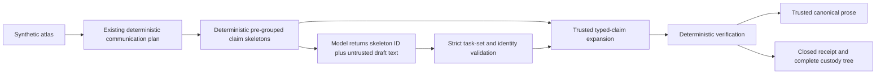

# Evidence communication compiler v4

## Prospective status and unchanged boundary

Version 4 is a prospective intervention motivated by the post-hoc analysis of the
closed v1 Qwen3 study. It is not an observed improvement and does not alter,
reinterpret, or authorize a rerun of that study. No real model was run or downloaded
while implementing or validating v4. The prospective v4 declaration is now frozen at
SHA-256 `e838b2a09245d1684c3bc41e39d49d09b5ff700703929aa1e6fe21b5c90a4090`;
it requires independent review and merge before a separately authorized execution.
See [the v4 study runbook](evidence-communication-v4-study.md).

The implementation and recorded synthetic fixture/replay benchmark remain
non-clinical. Clinical use, diagnosis, prognosis, treatment, protein ranking,
therapeutic-target designation, and druggability remain **NO-GO**. No result supports
a biological, causal, clinical, patient-specific, ranking, target, or actionability
claim.

Research evidence only. Not for diagnosis or treatment decisions.

## Intervention architecture

Version 3 remains complete and independently replayable under its original schemas,
prompt, transformation, verifier, fixture, CLI, and bundle identities. Version 4 is
implemented in separate modules, records, CLI commands, and fixture namespace.



Each skeleton contains a content-derived `skeleton:<sha256>` identity, exact canonical
gene and protein IDs, claim type, complete requirement-ID tuple, exact source IDs,
and every typed semantic field used by the verifier. Skeleton derivation fails closed
if plan coverage is missing, duplicated, overlapping, or unknown.

Two verifier units are explicitly pre-grouped:

- one `directional_assessment` skeleton binds
  `fact:directional_assessment` and `caveat:directional_scope`;
- one `source_target_evidence` skeleton binds its evidence fact and
  `caveat:source_target_boundary`.

Every other plan requirement appears in exactly one unambiguous skeleton.

## Bounded model contract

The model-owned response is only:

```json
{
  "entries": [
    {
      "draft_text": "untrusted text",
      "skeleton_id": "skeleton:<sha256>"
    }
  ]
}
```

The model does not return hashes other than the assigned skeleton selector, source
IDs, requirement bindings, typed evidence fields, canonical gene or protein IDs,
model identity, prompt identity, request identity, or source identity. The runner
adds immutable outer custody identities in trusted code after parsing. The
model-visible prompt states the exact `entries`, `draft_text`, and `skeleton_id`
envelope shape because Ollama's schema constrains generation but is not itself
injected into the model prompt.

For Ollama, top-level `format` is an explicit JSON Schema object, never generic
`"json"`. The schema fixes the exact top-level object, sets
`additionalProperties=false` at every object level, fixes the exact entry count,
uses ordinary object-valued `items`, and constrains `skeleton_id` to an `enum` of the
exact allowed IDs. It intentionally does not use `prefixItems`, `items=false`, or
per-position `const`, which are not a conservative llama.cpp grammar subset. The
grammar enforces object shape, entry count, allowed IDs, field names, and text-length
hints. Trusted parsing independently enforces the 1 to 500 Unicode-code-point text
bound, exact task order, uniqueness, completeness, and absence of unknown IDs.
Generation also uses temperature zero and top-level `think=false`. The persisted
runner configuration records locality, JSON mode, options, context window, timeout,
thinking mode, temperature, and declared-unverified environment settings.

The adapter permits only redirect-free, unauthenticated localhost HTTP. It observes
the exact runtime version and full model manifest digest immediately before and
after every generation. Transport failure, redirect, outer Ollama protocol drift,
runtime drift, manifest drift, ambiguous tag resolution, or custody identity drift
aborts the entire unpublished tree. Ollama `v0.35.1`'s official
[`GenerateResponse`](https://github.com/ollama/ollama/blob/v0.35.1/api/types.go)
serializes `model` and `done` as non-optional fields, and its
[non-streaming API example](https://github.com/ollama/ollama/blob/v0.35.1/docs/api.md#request-no-streaming)
returns the requested model tag with `done: true`. The adapter therefore requires
both fields, requires `model` to equal the declared tag, and requires `done` to be
exactly `true`.

## Invalid outcome rule

Model-owned content failures are preserved as digest-safe refused outcomes so later
frozen cases can continue:

- malformed JSON;
- a non-object envelope or non-array `entries`;
- missing or additional object properties;
- malformed task objects;
- empty, overlong, or invalidly encoded draft text;
- unknown skeleton IDs;
- duplicated skeleton IDs;
- omitted skeleton IDs;
- extra entries; or
- reordered entries.

No omission is repaired. Invalid-output custody stores only the error code, output
SHA-256, byte count, and aggregate task counts. It never stores malformed raw text.
Strict outer transport, runner protocol, and identity failures are not model-content
outcomes and abort atomic publication.

## Trusted expansion and prose

Accepted skeleton IDs are expanded deterministically into complete typed verified
claims. Raw draft text remains only in the parsed `draft.json` custody record. It
never enters a `VerifiedClaimV4`, exclusion, verified artifact, canonical sentence,
or researcher-facing prose.

Safety copy is generated only in trusted code. In particular:

- directional scope:
  “This directional comparison is limited to the reported layers and does not
  establish a mechanistic relationship, clinical utility, or actionability.”
- source-target boundary:
  “This is source metadata only; VoxelScope does not designate, prioritize, or
  evaluate the protein for actionability.”

These exact sentences preserve the requested boundaries without using the positive
causal, therapeutic-target, or druggability substrings blocked by the v3 lexical
filter. Trusted safety copy is not passed through that model-text filter.

## Versioned contracts

| Contract | Identity |
|---|---|
| Request | `voxelscope/evidence-communication-request/v4` |
| Bounded draft plan | `voxelscope/evidence-communication-draft-plan/v4` |
| Verified artifact | `voxelscope/verified-evidence-communication/v4` |
| Communication receipt | `voxelscope/evidence-communication-receipt/v4` |
| Benchmark fixture | `voxelscope/evidence-communication-benchmark-fixture/v4` |
| Benchmark report | `voxelscope/evidence-communication-benchmark/v4` |
| Benchmark index | `voxelscope/evidence-communication-benchmark-index/v4` |
| Benchmark receipt | `voxelscope/evidence-communication-benchmark-receipt/v4` |
| Runner measurement | `voxelscope/evidence-communication-runner-measurement/v4` |
| Invalid output | `voxelscope/evidence-communication-invalid-output/v4` |
| Transformation | `voxelscope/evidence-communication-compiler/v4` |
| Verifier | `voxelscope/evidence-communication-verifier/v4` |
| Prompt | `voxelscope/evidence-communication-bounded-draft/v4` |

## Commands

Run the recorded synthetic fixture benchmark without a model or network:

```bash
uv run python -m voxelscope.evidence_communication_v4_cli benchmark \
  --atlas build/gbm-atlas/atlas.json \
  --fixtures \
    research/gbm-evidence-communication-benchmark-v4/benchmark-fixtures.json \
  --runner recorded \
  --output build/evidence-communication-benchmark-v4
```

Replay the complete tree offline:

```bash
uv run python -m voxelscope.evidence_communication_v4_cli benchmark-replay \
  --atlas build/gbm-atlas/atlas.json \
  --fixtures \
    research/gbm-evidence-communication-benchmark-v4/benchmark-fixtures.json \
  --bundle build/evidence-communication-benchmark-v4
```

Both communication and benchmark publication use whole-directory atomic
no-replacement publication. Replay rejects missing, extra, swapped, noncanonical,
digest-mismatched, semantically inconsistent, aggregate-tampered, path-traversing,
or symlinked entries. It reconstructs request planning, skeleton derivation, trusted
expansion, verification, canonical prose, metrics, index, and receipt without model
or network access.

## Recorded synthetic fixture and replay metrics

The fixture retains the same nine conceptual cases and two repeats as v3. It is a
synthetic contract test, not model-quality evidence. Two cases intentionally produce
digest-safe task-set failures, and two parsed cases intentionally test semantic
refusal. The values below are deterministic recorded-fixture and offline-replay
values, not observed model evidence or an observed v4 improvement:

| Metric | Result |
|---|---:|
| Task/skeleton coverage | `266 / 270 = 0.9851851851851852` |
| Unknown-task rate | `2 / 270 = 0.007407407407407408` |
| Duplicate-task rate | `2 / 270 = 0.007407407407407408` |
| Omitted-task rate | `4 / 270 = 0.014814814814814815` |
| Invalid-model-output rate | `4 / 18 = 0.2222222222222222` |
| Unsupported-claim rate | `4 / 270 = 0.014814814814814815` |
| Emitted fact coverage | `94 / 158 = 0.5949367088607594` |
| Emitted caveat coverage | `76 / 148 = 0.5135135135135135` |
| Verified-draft fact coverage | `128 / 158 = 0.810126582278481` |
| Verified-draft caveat retention | `106 / 148 = 0.7162162162162162` |
| Evidence-citation validity | `258 / 258 = 1.0` |
| Replay semantic variance | `0 / 9 = 0.0` |
| Accepted or partially excluded runs | `10 / 18` |
| Refused runs | `8 / 18` |

Latency, input tokens, output tokens, peak memory, and peak Metal memory are
`unavailable`; they are not recorded as zero.

The conservative-schema compatibility fix changes the v4 prompt identity and,
therefore, parsed recorded-draft custody digests and enclosing fixture/receipt
digests. It does not change skeleton semantics, verifier outcomes, canonical prose,
or any aggregate numerator, denominator, or metric value.

These synthetic results must not be compared with the closed v1 observed study as an
improvement claim. A comparison requires a new declaration that freezes the v4
fixture, exact code and contract identities, model tag, full manifest digest,
runtime, host, environment, run count, metrics, and stop rules before any real model
execution.

## Remaining blockers before an observed v4 study

1. Independently review and merge the prospective declaration without executing it.
2. In a later fresh session, verify the merged declaration SHA-256 and run the
   sanitized two-check localhost preflight again.
3. Reconfirm that no real biomedical, patient, MRI, credential, token, or private
   path enters the run.
4. Give one explicit operator authorization bound to the merged declaration and
   consume the immutable attempt exactly once.
5. Preserve all clinical, diagnosis, prognosis, treatment, ranking,
   therapeutic-target, druggability, model-quality, production-safety, and real-data
   gates as **NO-GO**.
