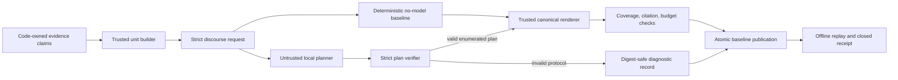

# Prospective v5 deterministic discourse-planner/no-model ablation contract

## Decision and scope

This milestone freezes a design contract, not a v5 implementation or study
execution declaration. Its single research question is:

> Does a local model add measurable communication value beyond deterministic code
> once evidence claims and final prose are code-owned?

The future local model may propose only enumerated discourse-plan choices over
code-owned unit IDs. It cannot author evidence values, source or claim IDs, safety
caveat text, clinical language, citations, final sentences, or publication
authorization. Trusted code owns every claim and sentence and always emits the
canonical safe prose.

During the ablation, the publication schema fixes `published_variant` to
`deterministic_baseline`. A verified model plan can produce a separately identified
candidate rendering for measurement, but cannot replace or corrupt the baseline.

## Frozen machine-readable contract and schemas

The canonical
[`design-contract.json`](../research/evidence-communication-v5-discourse-planner-contract-v1/design-contract.json)
has SHA-256
`b095544ccb45bba6482c3b7d3539363aacd6cbd443e89cbaacc7350301d437e5`.
It pins three strict JSON Schemas:

| Schema | SHA-256 | Purpose |
|---|---|---|
| [`discourse-request.schema.json`](../research/evidence-communication-v5-discourse-planner-contract-v1/discourse-request.schema.json) | `e379cbb96f114ae72c2c19d13b2863c68e9581b546d613ffa1c265a4daed39af` | Code-owned unit manifest, profiles, ordering/caveat constraints, and budgets |
| [`discourse-plan.schema.json`](../research/evidence-communication-v5-discourse-planner-contract-v1/discourse-plan.schema.json) | `0d0ca6c475bb853b0e3688f9bc90ae5df286b6e5ab9e2ce05d9a8c8037462a1c` | The complete bounded decision surface shared by model and baseline |
| [`publication-record.schema.json`](../research/evidence-communication-v5-discourse-planner-contract-v1/publication-record.schema.json) | `ec283220b04147b9984058a54efe569ec1579f3e4865f9b08768fc0d3150714b` | Closed baseline publication plus optional model-candidate diagnostics |

The request exposes only unit identity and planning metadata: unit kind, section,
mandatory status, canonical order, optional priority, byte cost, allowed profiles,
ordering edges, caveat anchors/placements, and exact budgets. It does not expose a
model-authorable prose field.

The plan contains exactly:

- `selected_audience_profile`, from two enumerated modes;
- `ordered_unit_ids`, with no duplicates or unknown IDs;
- `selected_optional_unit_ids`, explicitly bounded by the request;
- `caveat_placements`, using only allowed unit IDs, anchors, and placement enums;
- request/schema/terminal identity fields.

The verifier must require every mandatory unit exactly once, reject mandatory IDs
listed as optional, require optional IDs to be declared and eligible, enforce the
ordering DAG, validate every caveat placement, and enforce both unit-count and byte
budgets. JSON Schema success alone is insufficient.

## First-class deterministic baseline

The no-model comparator consumes the exact same request, emits the exact same plan
schema, passes through the exact same verifier, and uses the exact same renderer and
budgets. It is deliberately strong:

1. select the request's default audience profile;
2. rank eligible optional units by descending code-owned priority, ascending byte
   cost, then unit ID;
3. include units while both optional-count and rendered-byte limits hold;
4. perform a stable topological sort using section, canonical order, and unit ID;
5. place each caveat at its earliest allowed anchor, preferring
   `immediately_after`, then `section_end`, with unit-ID tie-breaking.

This algorithm is deterministic and replayable. A model does not receive credit for
matching it. If the local planner cannot produce a preregistered strict Pareto
improvement over it without a safety, protocol, utility, budget, latency, or token
regression, the declared conclusion is to remove the model from this layer.

## Trust boundaries and state

| Component | Authority |
|---|---|
| Unit builder | Owns claims, sentence units, values, citations, source bindings, safety copy, and required/optional status |
| Local planner | Untrusted proposal of enumerated plan decisions only |
| Plan verifier | Enforces schema, identity, set membership, coverage, ordering, caveat, profile, and budget rules |
| Renderer | Emits only canonical code-owned prose and citations |
| Publication code | Publishes the deterministic baseline; retains model results only as candidate diagnostics |

The future state machine must progress through pinned inputs, request preparation,
verified baseline, optional model response, verified plan or digest-safe protocol
failure, code rendering, closed publication, offline replay, and one atomic
no-replace rename. No model-generated fallback exists. A protocol failure records
only an error code, output SHA-256, and byte size; it cannot alter published claims.

Every future declaration must pin the repository commit/tree; all three schema
digests; claim set, unit manifest, renderer, baseline algorithm, verifier, prompt,
fixture, and repeat-design digests; full model manifest; runtime; options; and
localhost endpoint. Missing, extra, noncanonical, symlinked, digest-mismatched, or
semantically inconsistent custody fails closed.

Bounded model protocol failure is recorded without repair or retry. Repository,
schema, claim, unit, renderer, baseline, fixture, transport, runtime, model,
custody, file-set, digest, replay, or atomic-publication drift aborts the whole
future study. Warmup, retry, selective rerun, manual repair, post-hoc endpoint
changes, and partial publication are forbidden.

## Preregistered endpoint contract

| Endpoint | Exact future comparison | Role |
|---|---|---|
| Mandatory fact coverage | Emitted mandatory fact units / required mandatory fact units | Gate: must be `1` |
| Mandatory caveat coverage | Emitted mandatory caveat units / required mandatory caveat units | Gate: must be `1` |
| Citation validity | Code-bound renderer citations / all renderer citations | Gate: must be `1` |
| Protocol validity | Strictly valid plans / attempted plans | Gate: must be `1` for model value |
| Semantic plan variance | Repeat pairs with unequal verified semantic-plan digests / all repeat pairs | Diagnostic |
| Emitted size | Canonical UTF-8 rendered bytes | Model-minus-baseline delta |
| Budget compliance | Outputs within both declared budgets / outputs | Gate: must be `1` |
| Optional-unit utility | Sum of code-owned priority for eligible selected units; zero credit for invalid/over-budget units | Model-minus-baseline delta |
| Optional-unit selection | Eligible and ineligible selected counts reported separately | Diagnostic |
| Planner latency | Wall-clock planning time excluding the shared renderer | Model-minus-baseline delta |
| Input/output tokens | Runtime counters or explicitly unavailable, never imputed | Model-minus-baseline delta; baseline is zero |
| Baseline parity/delta | Direction-declared delta vector over every comparable endpoint | Primary decision input |

No scalar weighting may be invented after observation. Model value requires every
gate, no regression in mandatory coverage/citations/budget, and a strict Pareto
improvement on at least one preregistered comparable non-safety endpoint, reproduced
under the frozen repeat design. Parity is **no value**. Added latency or tokens
without an objective gain is **no value**. Any result available only through a
non-comparable endpoint is **no value**.

Subjective clarity, readability, usefulness, or quality is not an endpoint. Such a
claim would require a separate, prospectively declared, adequately powered, blinded
human-evaluation protocol with fixed rubrics and adjudication. v3/v4 free-form draft
coverage and lexical exclusion rates are also non-comparable to this interface.

## NO-GO boundaries

Clinical use, diagnosis, prognosis, treatment, patient-specific claims, biological
causality, protein ranking, therapeutic-target designation, druggability, real-data
acquisition, production readiness, and model-superiority claims remain **NO-GO**.
No biomedical data may be acquired and no inference or model mutation is authorized.

There is no v5 observed fixture or synthetic result presented as model evidence, no
full v5 compiler in this milestone, and no prospective study execution declaration.
A separately reviewed implementation and then a separately reviewed prospective
study declaration are required before any execution could be considered.
