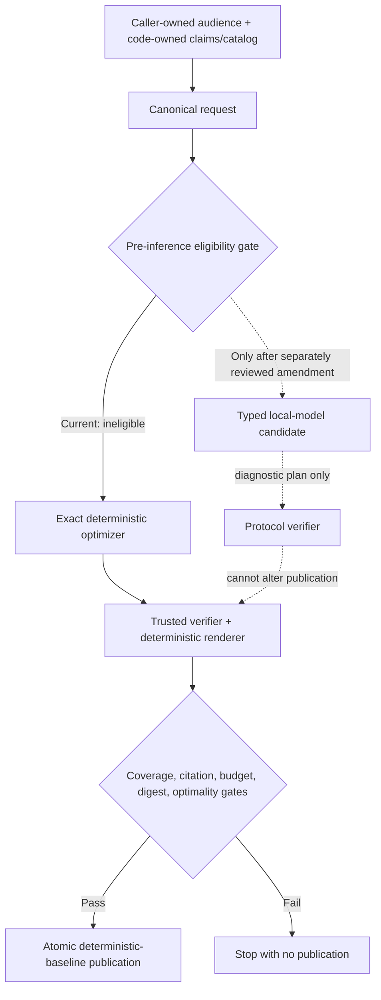

# Prospective v5 deterministic discourse-planner contract

## Status and question

This is a **prospective design contract only**. It does not implement the v5
compiler, declare or authorize a study execution, run a model, or present a v5
fixture or synthetic result as model evidence.

> Does a local model add measurable communication value beyond deterministic code
> once evidence claims and final prose are code-owned?

Under the endpoints declared here, the answer is not experimentally open:
deterministic code can exactly optimize every valued objective. The required next
step is therefore to implement deterministic v5, prove exact deterministic
dominance, and **stop before model inference**. A local planner becomes eligible
only after a separately reviewed prospective amendment declares a measurable
objective that deterministic optimization cannot settle.

## Evidence basis

The post-hoc v4 audit is mechanically reproducible at audit SHA-256
`a5735aad10d496950429282613cf15f04bb00bef7f773eda874979224c5f8573`.
It classifies the 108 frozen v4 lexical exclusions as:

- 12 explicit negations or boundary disclaimers;
- 4 affirmative clinical-process statements;
- 92 ambiguous or context-dependent statements; and
- 0 entries with both negation and affirmative-process context features.

These are post-hoc mechanical labels, not substantive unsafe-text truth. The
finding motivates removing free-form prose and naive substring authorization from
the future interface; it does not reinterpret the frozen v4 terminal results.

## Trust boundary and interfaces

| Surface | Trusted owner | Contract |
|---|---|---|
| evidence values, source IDs, citations, safety caveats, clinical boundaries, final sentences | code | never model-authored |
| audience profile | caller/operator request | exactly one frozen `audience_profile`; identical for baseline and any future candidate |
| mandatory facts, caveats, units, ordering constraints, optional utility, anchors, and budgets | code-owned request/catalog | canonical, digest-bound, closed before planning |
| baseline plan | exact deterministic optimizer | complete finite feasible-plan optimization |
| future model plan | currently ineligible local planner | typed enumerated decisions only, and only after a separately reviewed eligibility amendment |
| verification and publication | trusted code | fail closed; deterministic baseline only |

The strict request schema contains one caller-owned audience profile, mandatory
fact/caveat/unit IDs, request-enumerated optional units with code-owned integer
utility and byte bounds, allowed anchors, renderer identity, and output budgets.
It has no default/allowed audience set from which a planner can choose.

The strict plan schema contains only:

- one request digest and plan mode;
- an ordering of request-owned unit IDs;
- a subset of request-enumerated optional-unit IDs; and
- request-enumerated caveat anchors with `before` or `after` placement.

It contains no audience decision and no text field. A model may never author
evidence values, source identifiers, safety caveats, clinical language, new IDs,
or final prose. Unknown, duplicate, out-of-domain, malformed, or extra fields are
protocol failures, not content to repair into acceptance.

## Exact deterministic baseline

The no-model baseline is a first-class exact optimizer over the complete finite
feasible plan set. An implementation may use exhaustive enumeration, dynamic
programming, or branch-and-bound, but a non-exhaustive implementation must prove it
returns the same winner as full enumeration. A greedy approximation is forbidden.

For the frozen caller profile, the optimizer enumerates all allowed mandatory-unit
orders, optional-unit subsets, optional positions, and caveat anchor/placement
decisions. Every otherwise-feasible candidate is rendered with the same
deterministic renderer used for publication. Candidates are discarded unless they
satisfy the exact schemas, mandatory fact/caveat/citation/safety coverage,
ordering, cardinality, protocol, and byte-budget gates.

The winner is the lexicographic optimum:

1. **Require all feasibility gates.** If none passes, publish nothing.
2. **Maximize** the sum of request-pinned integer utility for selected optional
   units.
3. **Minimize** exact UTF-8 bytes emitted by the deterministic renderer, among
   maximum-utility plans.
4. **Minimize lexicographically** the repository-canonical JSON bytes of the
   decision key:
   - `ordered_unit_ids`;
   - `selected_optional_unit_ids`, sorted by unit ID; and
   - caveat decisions, sorted by caveat unit ID, anchor ID, then placement.

Schema version, request digest, and plan mode are excluded from the final
decision-key tie-break. The selected plan is lexicographically optimal and
Pareto-optimal for code-owned optional utility and emitted bytes: no feasible plan
can have at least as much utility and no more bytes with one strict improvement.

## Pre-inference model-eligibility gate

Eligibility is evaluated before prompt construction, model process start,
inference, API access, model mutation, or model artifact acquisition. It is
currently **false**:

- fact, caveat, citation, protocol, safety, and budget endpoints are hard code
  gates;
- optional-unit utility and emitted bytes are exactly optimized by deterministic
  code;
- audience identity is caller-owned and cannot be changed by a planner;
- ordering and caveat-placement differences have no declared value without a
  preregistered human endpoint; and
- deterministic planning uses zero model tokens and has effectively zero latency
  relative to local inference, so latency and tokens are costs a model cannot
  improve.

A future model run requires a separately reviewed prospective amendment with an
objective the exact optimizer cannot settle, frozen comparison and statistical
rules, and complete custody/stop rules. A subjective communication objective would
require a properly blinded human-evaluation protocol declared before any model
run. This contract declares no such endpoint.

## Architecture and state flow

The prospective state machine is:

`declared -> request_closed -> eligibility_checked ->
deterministic_plan_selected -> publication_staged -> publication_verified ->
published -> closed`

`eligibility_checked` occurs before any model action. Under this contract it
records ineligibility and continues only through deterministic planning. The
published variant is always `deterministic_exact_baseline`; a future eligible
candidate remains diagnostic and cannot alter canonical claims.

## Preregistered endpoints

| Endpoint | Direction | Role under this contract |
|---|---|---|
| mandatory fact coverage | exactly `1.0` | publication gate |
| mandatory caveat coverage | exactly `1.0` | publication gate |
| citation validity | exactly `1.0` | publication gate |
| protocol validity | valid only | publication gate |
| optional-unit utility | maximize | exact deterministic objective |
| emitted UTF-8 bytes | minimize after maximum utility | exact deterministic objective |
| optional-unit selection | record IDs and utility | diagnostic |
| deterministic parity/delta | candidate cannot be worse; positive value delta is impossible under current objectives | dominance check |
| planner latency | minimize cost | model cost, not model value |
| input/output tokens | minimize cost; baseline is zero | model cost, not model value |
| plan variance | record only | model-behavior diagnostic |
| semantic variance | identical plan must render byte-identically | renderer determinism gate |

Ordering and caveat-placement variation across different valid plans is
non-comparable, not value. Subjective readability, preference, coherence, or
communication quality is not claimed because no blinded human protocol exists.

## Custody, replay, and publication

All JSON uses repository canonical bytes: sorted keys, UTF-8, no NaN, and exactly
one trailing LF. A future implementation must pin the source revision and clean
repository state plus the request, schemas, sentence catalog, renderer, optimizer
implementation, eligibility record, exact objective version, canonical
decision-key version, selected plan, output, and publication record. Model
identity, artifact, runtime, decoding, and environment are pinned only if a later
reviewed amendment first establishes eligibility.

Offline replay must rebuild the same exact baseline and publication record from
safe committed artifacts without a model or network. Persisted custody uses
repository-relative identities and digests, never private host paths, credentials,
raw prompts, or environment dumps.

Publication is staged with the request, baseline plan, optimality proof,
eligibility record, verification record, and rendered output. Trusted code fsyncs
the files, recomputes all digests and gates, atomically renames the complete
directory, then writes an immutable terminal receipt last. No closed run may be
overwritten.

## Stop rules

Stop:

- before model inference while eligibility is false;
- with no publication if no deterministic feasible plan exists;
- on schema, identity, custody, replay, exact-optimality, coverage, citation,
  renderer, budget, or atomic-publication failure;
- a future eligible candidate on timeout, invalid protocol, unknown or duplicate
  ID, disallowed decision, digest mismatch, or non-deterministic replay; and
- rather than retrying or repairing a candidate unless a separately reviewed
  future declaration prospectively defines bounded attempts.

The baseline may never be weakened after candidate behavior is observed. A model
protocol or content failure is recorded separately and cannot corrupt trusted
claims, canonical safety prose, or deterministic publication.

## Non-comparable and NO-GO boundaries

This contract does not compare or claim clinical usefulness or safety, diagnosis,
prognosis, treatment quality, biological truth or causality, subjective
communication quality, v3/v4 latency or token values, or any v5 fixture as model
evidence.

The following remain **NO-GO**: clinical use, diagnosis, prognosis, treatment,
patient-specific claims, biological causality, ranking, therapeutic-target
designation, druggability, real-data acquisition, production readiness, and
superiority claims.
