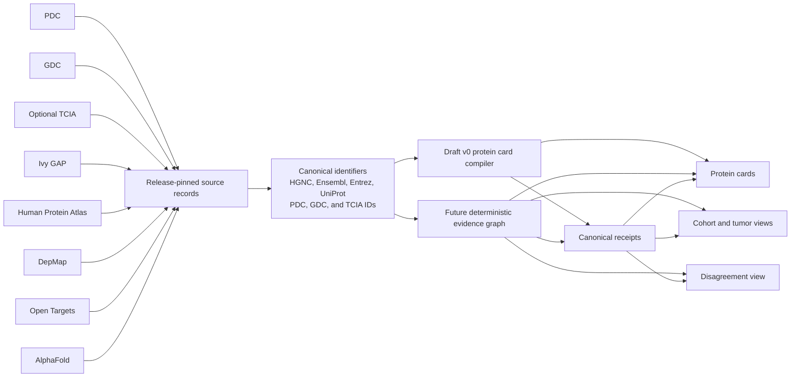

# Glioblastoma Evidence Atlas product contract v0

## Status

The Glioblastoma Evidence Atlas is a proposed research capability for VoxelScope. This specification defines its product boundary, evidence domain, identifier rules, reproducible workflow, release gates, and phased expansion.

Draft pull request [#12](https://github.com/Siddhant-K-code/VoxelScope/pull/12) provides the first executable synthetic slice at commit `26944afc04fba40d1661728441087f0d6fbae950`. That pull request is open and unmerged. This design branch remains independent from it and does not copy its schemas or implementation.

The product question is:

> Where do MRI phenotype, genomic alterations, RNA abundance, protein abundance, phosphorylation, spatial tumor state, functional dependency, normal-brain expression, source-reported target evidence, and protein structure agree, disagree, or remain unavailable?

The atlas does not infer diagnosis, prognosis, treatment, response, therapeutic suitability, or patient-specific validity. It does not label a protein as a therapeutic target. It remains useful without controlled MRI access.

## Product boundary

The atlas extends VoxelScope's evidence-preserving research model. It does not change the existing MRI segmentation protocol, authorize current private assets for a new use, or weaken an existing NO-GO gate.

Every public surface must show:

> Research evidence only. Not for diagnosis or treatment decisions.

"Agreement" and "disagreement" describe deterministic comparison states under a declared rule. They do not mean truth, causality, clinical utility, or therapeutic relevance.

### Users and jobs

| User | Job | Product response |
|---|---|---|
| Translational researcher | Compare evidence for one gene or protein across measurement layers | A protein card with source context, missingness, disagreement, and receipts |
| Computational biologist | Reproduce an evidence view | Canonical inputs, deterministic transforms, output digests, and replay receipts |
| Proteomics researcher | Trace protein and phosphosite observations | UniProt-based protein identity, sequence-bound sites, evidence records, and source provenance |
| Imaging researcher | Add matched MRI phenotype when access and linkage permit it | An optional imaging layer based only on explicit collection crosswalks |
| Research reviewer | Determine why a statement appears | A trace from card to evidence record, identifier mapping, source release, and receipt |
| Product steward | Publish a safe research release | Mechanical gates for identity, privacy, determinism, missingness, conflict, and copy |

### Non-goals

Version 0 does not:

- Diagnose glioblastoma or distinguish it from another condition.
- Recommend, rank, or imply a treatment.
- Label a gene or protein as a therapeutic target.
- Produce a patient-specific score, risk estimate, or clinical report.
- Infer a PDC, GDC, TCIA, or Ivy GAP match from similar metadata.
- Impute a missing modality or convert missingness into negative evidence.
- Reanalyze raw MRI, omics, slides, or model outputs.
- Implement production source ingestion, authentication, an API, or a polished interface.
- Commit controlled data, raw patient data, credentials, private paths, or private receipts.

## Draft v0 implementation context

Pull request #12 establishes the current executable boundary. Its concrete surfaces are:

- `src/voxelscope/gbm_atlas.py`
- `src/voxelscope/gbm_atlas_cli.py`
- `research/gbm-evidence-atlas-v1/source-manifest.json`
- `research/gbm-evidence-atlas-v1/identifier-map.json`
- `research/gbm-evidence-atlas-v1/evidence-items.json`
- `tests/test_gbm_atlas.py`

The command is:

```bash
uv run python -m voxelscope.gbm_atlas_cli build \
  --manifest research/gbm-evidence-atlas-v1/source-manifest.json \
  --output build/gbm-atlas
```

It writes canonical `atlas.json` and `receipt.json` files into a new output directory. It refuses overwrite. Repeating the command with unchanged inputs produces byte-identical output.

This separate module is intentional. `src/voxelscope/cli.py` is hash-pinned by the Milestone 5 preprocessing plan and must not be changed to expose the atlas.

### Draft v0 schemas

The draft owns these executable schemas:

| Schema | Purpose |
|---|---|
| `voxelscope/gbm-evidence-source-manifest/v1` | Binds the synthetic atlas ID, freshness date, and exact source artifacts |
| `voxelscope/gbm-identifier-map/v1` | Maps exact raw identifiers to canonical Ensembl gene and UniProt protein IDs with provenance |
| `voxelscope/gbm-evidence-items/v1` | Stores synthetic evidence records with modality, direction, context, measurement, date, and source |
| `voxelscope/gbm-protein-evidence-atlas/v1` | Stores deterministic protein cards, source freshness, and unsupported joins |
| `voxelscope/gbm-evidence-receipt/v1` | Binds source digests, transformation version, exclusions, warnings, and output digest |

The transformation identity is `voxelscope/gbm-evidence-transform/v1`.

The draft modality vocabulary is exact:

- `mutation`
- `rna_abundance`
- `protein_abundance`
- `phosphorylation`
- `spatial_expression`
- `dependency`
- `normal_brain_expression`
- `target_evidence`
- `alphafold_structure`

The draft is synthetic only. It does not contain imaging, subject, sample, or other individual-level records. It does not rank proteins.

### Draft v0 card semantics

Each card has one canonical Ensembl gene ID and one canonical UniProt protein ID. It contains ordered evidence, present modalities, missing modalities, and a directional assessment.

The current assessment is deliberately simple:

- `disagreement` means at least one `up` and at least one `down` record are present.
- `agreement` means at least two directional records are present and all are `up` or all are `down`.
- `insufficient` means fewer than two directional records are present.
- Agreement groups list a direction only when that direction has at least two evidence records.

The assessment currently spans the card's modalities and contexts. It is a synthetic compiler demonstration, not a biological conclusion. Production comparison must add the scope rules defined below before using those words for real source data.

Missing modalities are explicit. An unmapped raw identifier becomes an `unsupported_identifier_join` exclusion and an `unsupported_join` warning. It does not silently disappear or attach to the nearest card.

Source freshness is derived from each source release date, its positive staleness window, and the manifest assessment date. It reports `current` or `stale` and emits a warning for stale sources.

The receipt records:

- Atlas ID.
- Canonically sorted source artifact digests.
- Transformation version.
- Canonically sorted exclusions.
- Canonically sorted warnings.
- The SHA-256 of canonical `atlas.json`.

The builder verifies the output digest before publishing the new directory.

## Product architecture



Draft v0 compiles local synthetic source records directly into protein cards. Production adapters will first create immutable release records. Identifier resolution will run before graph construction. Queries will read an immutable graph snapshot and will not call source systems.

MRI is optional. Disabling TCIA must leave protein cards and non-imaging cohort views complete.

## Evidence domain contract

The draft v0 card and receipt schemas remain authoritative for their current surfaces. Broader entities, subject or sample graphs, MRI, API, and UI require a new versioned schema. They must not mutate the draft v1 meanings.

The following is the normative domain contract for that phased extension.

### Entities

| Entity | Required identity and fields | Rule |
|---|---|---|
| Source release | Source name, release ID, release date or unavailable reason, license, access tier, immutable locator, content digest | Every evidence item belongs to exactly one release |
| Subject | Source-scoped subject ID, access tier, legal availability | Optional and never inferred |
| Sample | Source-scoped sample or aliquot ID, sample kind, access tier, legal availability | Optional and linked only by source relationships |
| Gene | HGNC ID and Ensembl gene ID under pinned reference releases, optional Entrez Gene ID | Ambiguity refuses the record |
| Protein | UniProt accession and declared isoform | Exactly one canonical sequence identity |
| Phosphosite | UniProt accession, residue, one-based position, reference sequence digest | Bound to an exact protein sequence |
| Pathway | Source namespace, stable pathway ID, release | Source scoped |
| Spatial compartment | Source namespace and stable compartment term | Context, not a diagnosis |
| Dependency context | DepMap model ID, model system, source release | Dependency never loses model context |
| Imaging phenotype | Vocabulary, stable term, feature definition, access tier | Optional and not a diagnosis |
| Assertion | Subject, predicate, direction, value or unavailable reason, unit, comparison key, evidence strength, status | Must have evidence |
| Evidence item | Source record ID, measurement type, method, value or unavailable reason, unit, source release | Smallest receipt-traceable observation |
| Conflict | Kind, status, comparison key, linked assertions, resolution or unavailable reason | Preserves all source evidence |
| Receipt | Operation, software version, input digests, output digest, terminal status, timestamp | Covers each released transformation |

Allowed assertion predicates are:

- `genomic_alteration`
- `rna_expression`
- `protein_abundance`
- `phosphorylation`
- `spatial_state`
- `functional_dependency`
- `normal_brain_expression`
- `source_target_evidence`
- `structure_availability`
- `imaging_association`

Allowed normalized directions are `increased`, `decreased`, `present`, `absent`, `associated`, `not_associated`, `neutral`, and `unavailable`.

### Edges

| Edge | From | To | Cardinality and rule |
|---|---|---|---|
| `release_contains` | Source release | Subject, sample, pathway, compartment, dependency context, or imaging phenotype | Zero or more explicit source members |
| `sample_from_subject` | Sample | Subject | At most one within the source relationship |
| `protein_encoded_by` | Protein | Gene | Exactly one canonical gene mapping in the selected reference release |
| `phosphosite_on_protein` | Phosphosite | Protein | Exactly one sequence-bound protein |
| `gene_member_of_pathway` | Gene | Pathway | Zero or more release-scoped memberships |
| `protein_member_of_pathway` | Protein | Pathway | Zero or more release-scoped memberships |
| `sample_from_spatial_compartment` | Sample | Spatial compartment | Zero or more explicit annotations |
| `imaging_phenotype_of` | Imaging phenotype | Subject or sample | Zero or more explicit collection relationships |
| `assertion_subject` | Assertion | Gene, protein, phosphosite, pathway, compartment, dependency context, or imaging phenotype | At least one |
| `assertion_context` | Assertion | Subject, sample, compartment, dependency context, or imaging phenotype | Zero or more declared contexts |
| `assertion_supported_by` | Assertion | Evidence item | At least one support or opposition edge |
| `assertion_opposed_by` | Assertion | Evidence item | Zero or more explicit counter-records |
| `evidence_from_release` | Evidence item | Source release | Exactly one |
| `evidence_from_subject` | Evidence item | Subject | Zero or one legally available subject |
| `evidence_from_sample` | Evidence item | Sample | Zero or one legally available sample |
| `conflict_has_assertion` | Conflict | Assertion | At least two |
| `conflict_about` | Conflict | An assertion subject | Same subject set as every linked assertion |
| `receipt_covers_release` | Receipt | Source release | At least one receipt per published release |
| `receipt_covers_evidence` | Receipt | Evidence item | Required for transformed evidence |
| `receipt_covers_assertion` | Receipt | Assertion | Required for deterministic derived assertions |
| `receipt_covers_conflict` | Receipt | Conflict | Required for generated conflicts |

Every future graph node and edge has a unique stable local ID. Nodes and edges are canonically sorted. Dangling edges, self-edges, duplicate canonical identities, unknown fields, nonfinite values, and invalid endpoints are refused.

### Compatibility with draft v0

| Draft v0 surface | Future domain mapping |
|---|---|
| Source manifest entry | Source release plus receipt input |
| Identifier mapping | Gene and protein identities plus mapping provenance |
| Evidence item | Evidence item and source-reported assertion |
| Protein card | Projection over gene, protein, assertions, evidence, missingness, and conflicts |
| Directional assessment | A card summary derived only after future comparison-scope checks |
| Unsupported join exclusion | Refused or unavailable join with receipt evidence |
| Source freshness | Source release status |
| Receipt | Receipt entity with covered inputs and output snapshot |

The future graph may project back to `voxelscope/gbm-protein-evidence-atlas/v1` only when it can preserve every draft field and meaning. Otherwise it introduces a new schema version and migration note.

## Identifier and join rules

### Draft v0 exact behavior

Draft v0 indexes every identifier mapping by the exact pair `(namespace, value)`.

- Each mapping has one `canonical_gene_id` beginning with `ENSG`.
- Each mapping has one nonempty `canonical_protein_id`.
- Each mapping contains exact `ensembl-gene` and `uniprot` identifiers matching those canonical IDs.
- A pinned mapping may also contain `hgnc-symbol`.
- Mapping provenance contains exact `source_id` and `record_id`.
- Every provenance source must exist in the source manifest.
- One raw identifier resolving to more than one mapping stops the build with `ambiguous_identifier_mapping`.
- No mapping produces an explicit `unsupported_identifier_join` exclusion.

Draft v0 does not normalize versioned Ensembl IDs, HGNC IDs, Entrez IDs, phosphosite coordinates, or subject IDs. Production code must not treat that absence as permission to guess.

### Production resolver rules

Reference releases are inputs. Each build pins exact HGNC, Ensembl, NCBI Gene, and UniProt mapping releases and records their digests.

| Identifier | Canonical form | Join rule |
|---|---|---|
| HGNC | `HGNC:<positive integer>` | A symbol is lookup input only; the HGNC ID is canonical |
| Ensembl gene | Unversioned `ENSG` plus 11 digits | Preserve the source value; remove a version only when the pinned mapping resolves it to the same stable gene |
| Entrez Gene | Positive decimal integer as text | Optional cross-reference; never overrides conflicting HGNC or Ensembl identity |
| UniProt | Valid accession, with explicit isoform suffix when applicable | A protein requires UniProt and a declared canonical isoform policy |
| Phosphosite | `<UniProt accession>:<one-letter residue><one-based position>` | Residue and position must match the exact sequence digest |
| PDC | Lowercase UUID for case, sample, or aliquot ID | Identifier level is explicit; never join by submitter label |
| GDC | Lowercase UUID for case, sample, or aliquot ID | Use GDC relationships, not string similarity |
| TCIA patient | `<collection>/<PatientID>` | Collection qualification is mandatory |
| TCIA study and series | DICOM Study Instance UID or Series Instance UID | Link only through a collection-published crosswalk |
| Ivy GAP | Exact source structure or sample key under a pinned release | Do not infer a PDC or GDC subject |
| Human Protein Atlas | Exact source record joined through pinned Ensembl or UniProt mapping | Keep normal-brain context distinct from tumor context |
| DepMap | Exact model ID plus release, then canonical gene identity | Keep dependency scoped to the named model system |
| Open Targets | Exact release and Ensembl `targetId` | Display as source-reported target evidence |
| AlphaFold | Exact release and UniProt accession | Record structure model availability only |

PDC to GDC, GDC to TCIA, and every other cross-source subject or sample join require a source-published, release-pinned crosswalk at the same identifier level. Disease label, patient-like string, sample date, file name, and molecular similarity are never join keys.

Zero matches produce an unavailable or unsupported record with a reason. More than one match refuses the build. Conflicting HGNC, Ensembl, Entrez, or UniProt mappings refuse the record. The resolver never chooses the first match, guesses from a symbol, or merges published nodes.

## Deterministic workflow

### 1. Source sync

Draft v0 uses three checked-in canonical synthetic files and performs no network access. The manifest acts as the sync boundary: it pins source paths, source IDs, URIs, release dates, freshness windows, synthetic status, and SHA-256 digests.

Production sync is a later command:

```bash
python -m voxelscope.gbm_atlas_cli source-sync \
  --manifest research/gbm-evidence-atlas/source-manifest-v2.json \
  --output-private /owner-private/gbm-atlas/releases
```

This proposed command requires explicit allowlisted network access, verifies licenses and expected hashes, writes no-clobber source receipts, and keeps controlled artifacts outside the repository.

### 2. Graph or card build

The available draft command is:

```bash
uv run python -m voxelscope.gbm_atlas_cli build \
  --manifest research/gbm-evidence-atlas-v1/source-manifest.json \
  --output build/gbm-atlas
```

It validates source digests and schemas, resolves exact identifiers, sorts evidence, assembles cards, reports missing modalities and unsupported joins, assesses freshness, emits warnings, writes the atlas and receipt canonically, and verifies the atlas digest before no-clobber publication.

A future graph build may add `graph-build`, but it must preserve the existing `build` behavior.

### 3. Evidence-card query

Draft v0 exposes cards in `build/gbm-atlas/atlas.json`. It has no query command.

The proposed read-only query is:

```bash
python -m voxelscope.gbm_atlas_cli card-show \
  --atlas build/gbm-atlas/atlas.json \
  --uniprot P12345 \
  --format json
```

The result groups evidence by modality and context and includes missingness, unsupported joins, freshness, comparison scope, conflicts, and receipt identity. It never ranks proteins.

### 4. Receipt verification

Draft v0 verifies the output digest during the build and writes `receipt.json`. It has no standalone verification command.

The proposed verifier is:

```bash
python -m voxelscope.gbm_atlas_cli receipt-verify \
  --atlas build/gbm-atlas/atlas.json \
  --receipt build/gbm-atlas/receipt.json
```

It recomputes the canonical atlas digest, verifies source digests and transformation identity, checks exclusions and warnings, and returns a terminal verified or refused state.

## Missing-data behavior

Missing, restricted, unsupported, stale, and not measured are not negative evidence.

Draft v0:

- Lists every absent modality in `missing_modalities`.
- Lists every unjoined evidence record in `unsupported_joins`.
- Emits `missing_evidence`, `unsupported_join`, `stale_source`, and `contradictory_evidence` warnings as applicable.
- Never creates an empty success card for an unknown identifier.

Production:

- Represents available evidence with a value and no missing reason.
- Represents missing or restricted evidence with no value and a nonempty reason.
- Uses `unavailable` direction only for unavailable assertions.
- Produces neither agreement nor disagreement from a missing modality.
- Keeps source-specific cohort denominators visible.
- Leaves molecular cards usable when matched MRI is absent.

The UI copy for absent MRI is:

> No matched MRI evidence is available for this scope.

## Conflict and evidence-strength semantics

### Draft v0

Draft v0 uses `directional_assessment.state`, not an evidence-strength score. Its `agreement`, `disagreement`, and `insufficient` states are defined above. Unsupported joins and missing modalities remain separate.

### Production

Production uses categories, not a blended numeric score.

| Strength | Mechanical meaning |
|---|---|
| `source_reported` | Available evidence from one source release supports the assertion |
| `deterministic_derived` | A versioned deterministic transform produced the assertion and a receipt covers it |
| `cross_source_concordant` | At least two source releases support the same subject, predicate, direction, and comparison key with no opposition |
| `conflicted` | An explicit conflict links opposing or non-comparable assertions |

Conflict kinds are:

- `directional`: eligible assertions have opposing normalized directions.
- `method`: assay or processing differences explain disagreement or non-comparability.
- `identifier`: source identities conflict. This normally refuses a production build.
- `scope`: tumor, normal tissue, spatial compartment, model system, cohort, or imaging scopes differ.

A conflict is `open`, `resolved`, or `not_comparable`. Resolution text adds a reviewed explanation. It never deletes evidence or rewrites an assertion.

Production comparison requires the same canonical subject, predicate, declared context, unit compatibility, and comparison key. Normal brain and tumor, tissue and cell model, or unmatched cohorts are not silently compared.

## Proposed API and eventual UI

The API is read-only over one immutable atlas or graph snapshot:

| Surface | Purpose |
|---|---|
| `GET /v0/atlas/proteins/{uniprot}` | Protein card with evidence, missingness, conflicts, freshness, and receipts |
| `GET /v0/atlas/cohorts/{source}/{release}` | Source-specific cohort evidence and denominators |
| `GET /v0/atlas/tumors/{source}/{subject}` | Legally available subject or sample evidence only |
| `GET /v0/atlas/disagreements` | Stable conflict records and comparison scopes |
| `GET /v0/atlas/receipts/{receipt_id}` | Receipt and covered graph objects |
| `GET /v0/atlas/snapshot` | Schema, source releases, transformation version, and root digest |

The eventual interface has four calm surfaces:

- Protein card: one canonical identity with layer-by-layer evidence and receipt links.
- Cohort view: source-specific distributions and denominators without default pooling.
- Tumor view: only legally available linked evidence, with MRI clearly optional.
- Disagreement view: opposing or incomparable assertions with subject, scope, sources, and resolution state.

The API and UI do not accept clinical input, infer identities, trigger source sync, or call live source systems.

## Copy rules

Public prose uses sentence case and these rules:

- Always show "Research evidence only. Not for diagnosis or treatment decisions."
- Say "protein" or "gene", not "target".
- Say "source-reported target evidence" for Open Targets data.
- Say "dependency in this model context", not "essential for this tumor".
- Say "structure model available", not "druggable" or "bindable".
- Say "associated in this source and scope", not "predicts".
- Say "agreement under the declared comparison rule", not "validated".
- Say "unavailable", "restricted", "unsupported", or "not comparable" rather than silently omitting data.
- Do not rank proteins, patients, or treatments.
- Do not use clinical action verbs such as prescribe, select therapy, or recommend.

## Release gates

A release is GO only when every applicable gate passes.

| Gate | Required evidence |
|---|---|
| Implementation identity | Exact schema and transformation versions, reviewed code identity, and migration decision |
| Source qualification | Pinned release, locator, digest, license, access tier, permitted fields, freshness policy, and adapter |
| Identifier resolution | Pinned reference releases, zero ambiguous joins, zero guessed aliases, and explicit crosswalk evidence |
| Determinism | Two clean builds from the same inputs produce byte-identical canonical outputs and receipts |
| Domain integrity | Strict fields, unique IDs, valid endpoints, closed cardinality, deterministic ordering, and no dangling references |
| Privacy | No controlled data, raw patient data, credentials, private paths, private receipts, or individual-level synthetic lookalikes in public artifacts |
| Missingness | Missing, restricted, stale, and unsupported states have explicit reasons and cannot look successful |
| Evidence semantics | Every assertion has evidence, every transformed assertion has a receipt, and comparison scope is exact |
| Copy | Non-clinical banner and copy checks pass; no diagnosis, treatment advice, protein ranking, or VoxelScope target label appears |
| Receipt verification | Source digests, transformation identity, output digest, exclusions, and warnings verify |
| MRI isolation | Protein cards work when TCIA and controlled MRI access are disabled |

Draft v0 additionally requires:

- `synthetic_only: true`
- `ranking_performed: false`
- Every source, manifest, and evidence item marked synthetic
- No imaging or individual-level records
- Ambiguous mappings to stop the build
- Unsupported mappings to remain explicit exclusions
- The output-language safety check to pass

Any failure is a NO-GO release. One passing source or view cannot override another failed gate.

## Phased implementation plan

### Phase 0: synthetic protein-card compiler

Review and, if approved, merge draft PR #12. Preserve its five schema identities, transformation identity, fixture digests, deterministic replay, no-clobber output, ambiguity refusal, exclusions, warnings, and separate CLI module.

This phase is not merged at the time of this specification.

### Phase 1: smallest real molecular vertical slice

Qualify one permitted release each from PDC, GDC, and Human Protein Atlas. Add a new schema version for real source records. Build one offline, read-only protein card with genomic or RNA, protein or phosphorylation, normal-brain context, missingness, comparison scope, and receipts.

Do not add subject-level linkage unless each source explicitly permits it.

### Phase 2: domain graph, spatial state, and dependency

Introduce the versioned entity and edge contract defined here. Add Ivy GAP spatial compartments and DepMap dependency contexts. Preserve source and model context. Do not pool them into a score.

### Phase 3: source-reported evidence and structure

Add Open Targets source-reported target evidence and AlphaFold structure availability. Do not label proteins as targets or infer druggability.

### Phase 4: optional matched-MRI layer

Qualify a TCIA collection and its published GDC crosswalk. Add collection-qualified PatientID, Study Instance UID, Series Instance UID, imaging phenotype vocabulary, controlled-data custody, and access review.

The molecular atlas remains fully useful when this phase is absent or disabled.

### Phase 5: read-only query surfaces

Add receipt verification and card query commands to `gbm_atlas_cli.py`, then expose the read-only API and four interface views. Add accessible empty, missing, restricted, unsupported, stale, and conflict states before visual polish.

## Dependencies and unresolved milestones

The design reuses VoxelScope canonical JSON, strict field validation, SHA-256 identities, no-clobber publication, receipts, privacy scans, and research-only boundaries.

The immediate executable dependency is open draft PR #12 at commit `26944afc04fba40d1661728441087f0d6fbae950`. This design does not assume it will merge unchanged. Any later implementation must rebase on the merged schema and migration decision.

The molecular vertical slice does not depend on Milestone 8 model loading or real MRI inference. It must not reuse the current private OpenNeuro subject, model archive, preprocessing output, or window evidence. Those assets were authorized for a different protocol.

The optional matched-MRI phase requires a separate source qualification and custody milestone for the chosen TCIA collection, its terms, its GDC crosswalk, permitted identifiers, and imaging phenotype definitions. Existing Milestones 4 through 8 provide safety patterns but do not authorize this use.

Real source manifests and adapters for PDC, GDC, TCIA, Ivy GAP, Human Protein Atlas, DepMap, Open Targets, and AlphaFold remain unimplemented or unqualified in this branch. This specification does not claim that any source is ready.
